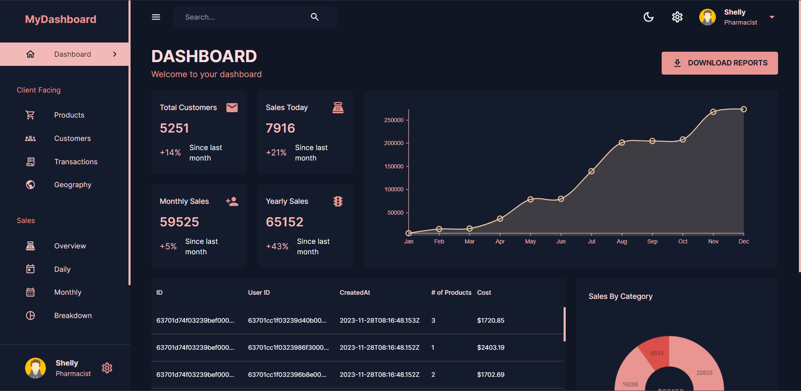

# MERN Dashboard Project



Welcome to the MERN Dashboard Project—a powerful, full-stack application built with the MERN (MongoDB, Express.js, React, Node.js) stack. This dashboard offers an intuitive interface for data visualization, product management, customer interactions, and sales analytics. With light and dark mode themes and a fully responsive design, it delivers a seamless experience across devices, making it ideal for both developers and end-users.

## Table of Contents

1. [Introduction](#introduction)
2. [Features](#features)
3. [Technologies Used](#technologies-used)
4. [Packages Used](#packages-used)
5. [Installation](#installation)
6. [Folder Structure](#folder-structure)
7. [Running the Application](#running-the-application)
8. [Author](#author)
9. [Documentation](#documentation)

---

## Introduction

The MERN Dashboard Project is a robust, full-featured application designed to streamline data management and visualization. Built with the MERN stack, it combines a React-based frontend—powered by Nivo for charts and Material-UI for sleek UI components—with a backend driven by Express.js and MongoDB via Mongoose. Whether you’re tracking sales, managing products, or analyzing customer data, this dashboard provides a centralized solution with multiple tabs tailored to various business needs. Its responsive design and theme-switching capabilities ensure accessibility and comfort for all users.

---

## Features

### Client Tabs
- **Dashboard**: A snapshot of critical metrics and insights for at-a-glance monitoring.
- **Products**: Tools to create, update, and manage product information.
- **Customers**: A hub for customer data, interactions, and preferences.
- **Transactions**: Detailed tracking and visualization of transaction records.
- **Geography**: Location-based insights with geographical data visualization.

### Sales Tabs
- **Overview**: A high-level summary of sales performance.
- **Daily**: Real-time daily sales data for immediate analysis.
- **Monthly**: Trends and patterns in monthly sales figures.
- **Breakdown**: Granular insights into sales data for deeper evaluation.

### Management Tabs
- **Admins**: Manage administrative tasks and user permissions.
- **Performance**: Monitor system performance and operational metrics.

### Visual Customization
- **Light and Dark Mode**: Toggle between themes to suit your preference or environment.

### Responsiveness
- **Responsive Design**: Adapts effortlessly to desktops, tablets, and mobile devices for a consistent experience.

---

## Technologies Used

### Frontend
- **React**: Dynamic, component-based UI development.
- **Nivo**: Interactive and customizable data visualization charts.
- **Material-UI (MUI/MUI-X)**: Modern UI components and data grids.
- **React Router DOM**: Smooth navigation with client-side routing.

### Backend
- **Node.js**: Scalable server-side runtime environment.
- **Express.js**: Fast and minimal framework for API development.
- **MongoDB**: Flexible NoSQL database for data storage.
- **Mongoose**: Simplified MongoDB interactions with schema-based modeling.

### Other Technologies
- **HTML/CSS**: Core structure and styling.
- **JavaScript (ES6+)**: Unified language across the stack.

---

## Packages Used

### Client-Side
- `@emotion/react`: CSS-in-JS for flexible styling.
- `@mui/icons-material`: Rich icon library for UI enhancement.
- `@mui/material`: Core Material-UI components.
- `@mui/x-data-grid`: Advanced data tables for tabular data display.
- `@nivo/bar`, `@nivo/core`, `@nivo/geo`, `@nivo/line`, `@nivo/pie`: Charting tools for diverse visualizations.
- `react-datepicker`: User-friendly date selection component.
- `react-redux`: Centralized state management.
- `react-router-dom`: Routing for single-page applications.

### Server-Side
- `body-parser`: Parses incoming request bodies.
- `cors`: Enables cross-origin resource sharing.
- `dotenv`: Loads environment variables securely.
- `express`: Core framework for API routes.
- `helmet`: Enhances security with HTTP headers.
- `mongoose`: MongoDB object modeling.
- `morgan`: Logs HTTP requests for debugging.
- `nodemon`: Auto-restarts server during development.

---

## Installation

### Environment Variables Setup

To configure the project, you’ll need to set up environment variables for both the client and server.

#### Client-Side
Create a `.env` file in the `client` directory:
```bash
VITE_APP_BASE_URL="http://localhost:5001"
```
This points the client to the server’s API endpoint.

#### Server-Side
Create a `.env` file in the `server` directory:
```bash
MONGO_URL="YOUR_MONGODB_URL"
PORT=5001
```
Replace `YOUR_MONGODB_URL` with your MongoDB connection string. The `PORT` defines where the server runs.

**Security Note**: Keep `.env` files out of version control by adding them to `.gitignore` to protect sensitive data like database credentials.

### Getting Started
1. **Clone the Repository**:
```bash
git clone https://github.com/Soumyaditya25/MERNSight-Dashboard.git
```

2. **Set Up the Client**:
```bash
cd client
npm install
npm run dev
```

3. **Set Up the Server**:
```bash
cd server
npm install
npm run dev
```

4. **Access the Dashboard**: Open `http://localhost:5173` in your browser.

---

## Folder Structure

Here’s how the project is organized:

```
MERNSight-Dashboard/
├── client/               # Frontend code (React)
│   ├── public/           # Static assets (e.g., images)
│   ├── src/              # Core React source code
│   │   ├── assets/       # Images, fonts, etc.
│   │   ├── components/   # Reusable UI components
│   │   ├── scenes/       # Dashboard pages (e.g., Dashboard, Products)
│   │   ├── state/        # API service logic
│   │   ├── main.jsx      # App entry point
│   ├── .env              # Client-side environment variables
│   ├── package.json      # Client dependencies and scripts
│   └── ...
├── server/               # Backend code (Node.js, Express)
│   ├── controllers/      # Logic for handling API requests
│   ├── models/           # Mongoose schemas
│   ├── routes/           # API endpoints
│   ├── data/             # Sample data for database seeding
│   ├── app.js            # Server setup
│   ├── .env              # Server-side environment variables
│   ├── package.json      # Server dependencies and scripts
│   └── ...
```

This modular structure keeps client and server code separate for clarity and scalability.

---

## Running the Application

- **Server**: From the `server` directory, run:
```bash
npm run dev
```
- **Client**: From the `client` directory, run:
```bash
npm run dev
```

Visit `http://localhost:5173` to explore the dashboard.

---

## Author

- **Soumyaditya**  
  GitHub: [@Soumyaditya25](https://github.com/Soumyaditya25)

---

## Documentation

For deeper insights into the tools used, check out these resources:
- **[React](https://reactjs.org/docs/getting-started.html)**: Build dynamic UIs.
- **[Nivo](https://nivo.rocks/docs/)**: Create stunning visualizations.
- **[Material-UI](https://mui.com/getting-started/usage/)**: Design modern interfaces.
- **[Express.js](https://expressjs.com/en/starter/installing.html)**: Develop robust APIs.
- **[MongoDB](https://docs.mongodb.com/)**: Master NoSQL databases.
- **[Mongoose](https://mongoosejs.com/docs/)**: Simplify MongoDB interactions.
- **[React Router DOM](https://reactrouter.com/web/guides/quick-start)**: Handle navigation effortlessly.

---

This documentation is crafted to showcase your MERN Dashboard Project comprehensively. It’s designed to be user-friendly, detailed, and reflective of your project’s unique features and setup. Feel free to tweak it further to match your vision!